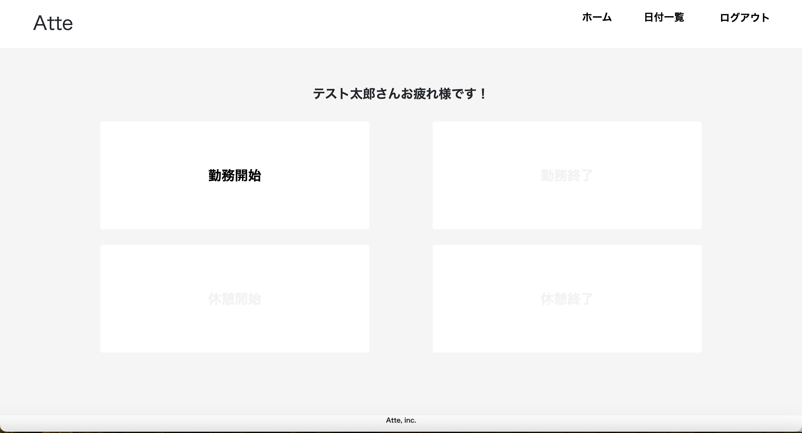
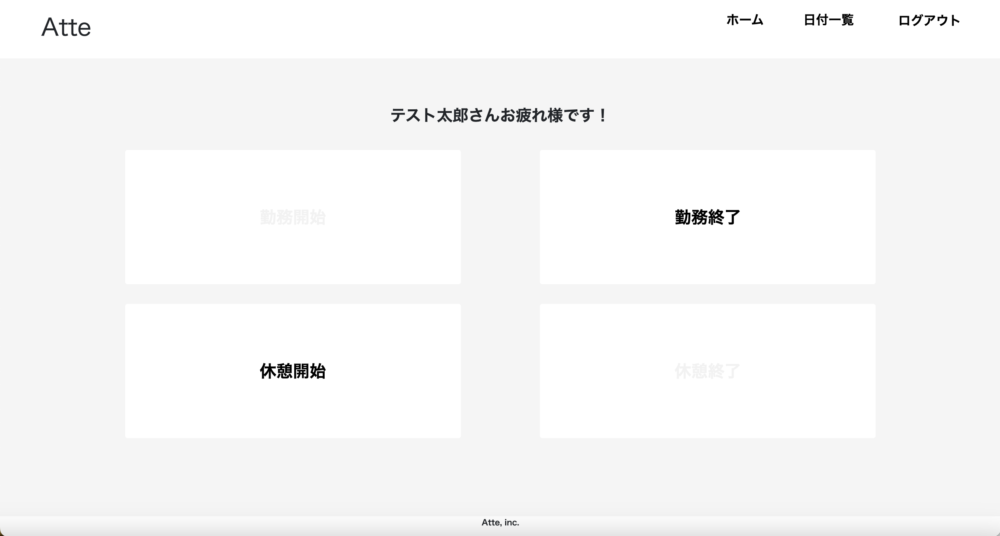
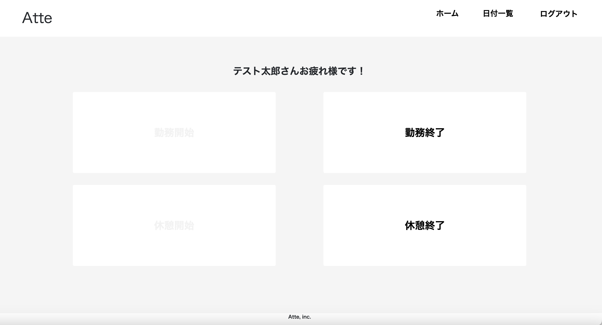

# Atte
### “Atte（アット）”は勤怠管理システムです。 
利用するには会員登録が必要となります。 
【勤務開始前の状態】 

【勤務開始後の状態/休憩終了後の状態】 

【休憩開始後の状態】 

***

## 作成した目的
模擬案件(初級)として作成しました。

***

## 機能一覧
* 会員登録機能(メール認証未完成)
* ログイン機能
* ログアウト機能
* 勤怠開始機能
* 勤怠終了機能
* 休憩開始機能(1日に何度でも可能)
* 休憩終了機能(1日に何度でも可能)
* 日付別勤怠情報取得機能
* ユーザー別勤怠情報取得機能
* ページネーション機能(5件ずつ取得)

**0時をまたいで勤務・休憩を終了する際の仕様について**

- 勤務終了
    - 勤務を開始する際に作成されたworkレコードのwork_endを24:00:00で更新
    - 新しいworkレコードをwork_startを00:00:00、work_endを現在時刻で作成
- 休憩終了
    - 休憩を開始する際に作成されたrestレコードのrest_endを24:00:00で更新
    - 勤務を開始する際に作成されたworkレコードのwork_endを24:00:00で更新
    - 新しいworkレコードをwork_startを00:00:00、work_endをnullで作成
    - 新しいrestレコードをrest_startを00:00:00、rest_endを現在時刻で作成

**ユーザー別勤怠情報取得(個別勤怠表ページの表示)方法について**

1. 打刻ページ右上【日付一覧】をクリック
1. 日付一覧ページ右上【ユーザー一覧】をクリック
1. ユーザー一覧ページのユーザー名をクリック

***

## 使用技術
* Laravel 8.x
* Laravel Fortify
* PHP 7.4.9
* MySQL 8.0.26
* Niginx
* Docker/Docker-compose
* Node.js
* bootstrap

***

## テーブル設計
### usersテーブル
|Column|Type|Options| 
|:---:|:---:|:---:| 
|name|varchar(191)|null: false|
|email|varchar(191)|null: false|
|password|varchar(191)|null: false|
|created_at|timestamp|———|
|updated_at|timestamp|———|

### worksテーブル
|Column|Type|Options| 
|:---:|:---:|:---:| 
|user_id|bigint|null: false|
|date|date|null: false|
|work_start|time|———|
|work_end|time|———|
|created_at|timestamp|———|
|updated_at|timestamp|———|

### restsテーブル
|Column|Type|Options| 
|:---:|:---:|:---:| 
|work_id|bigint|null: false|
|date|date|null: false|
|rest_start|time|———|
|rest_end|time|———|
|created_at|timestamp|———|
|updated_at|timestamp|———|

***

## ER図

